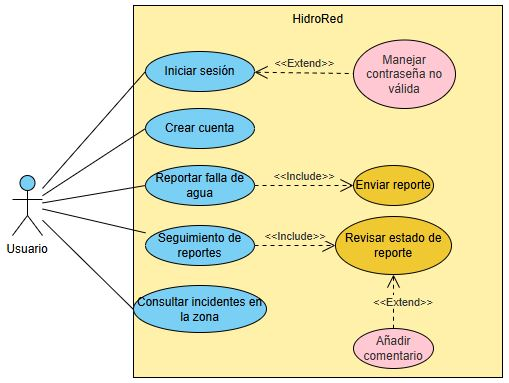
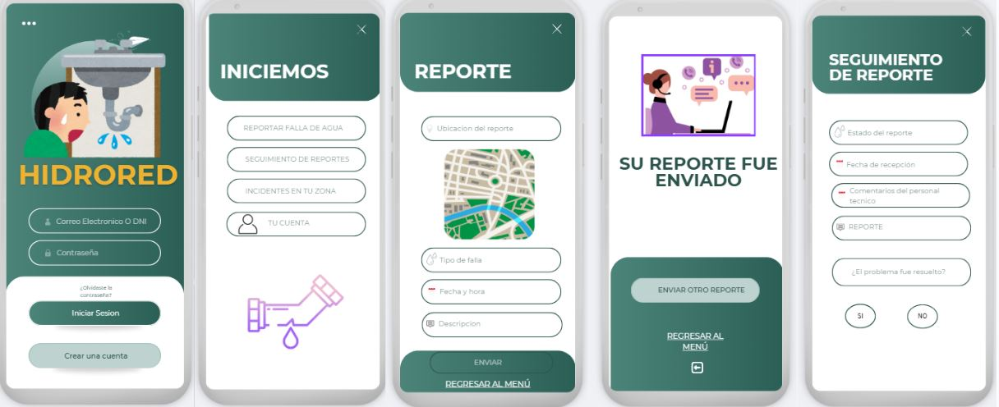
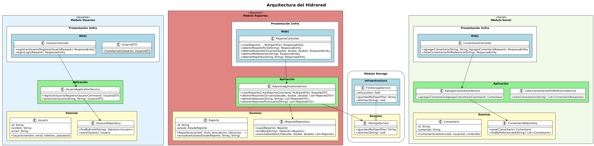
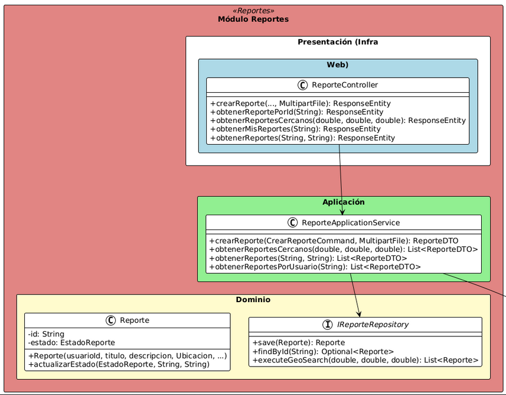
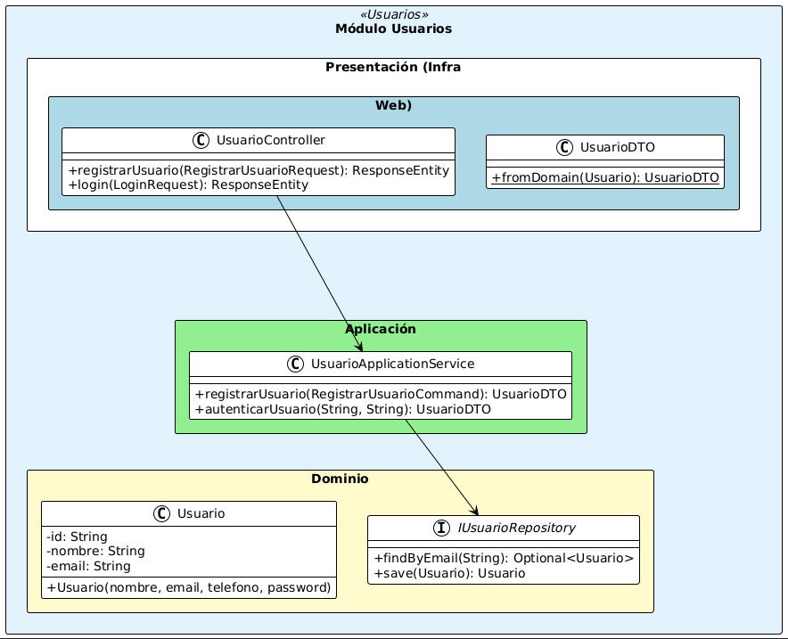
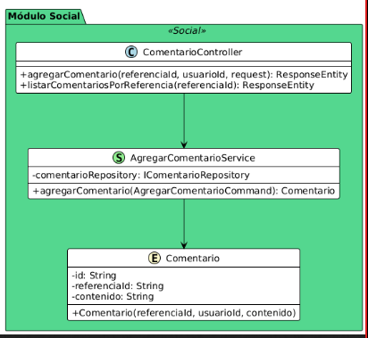
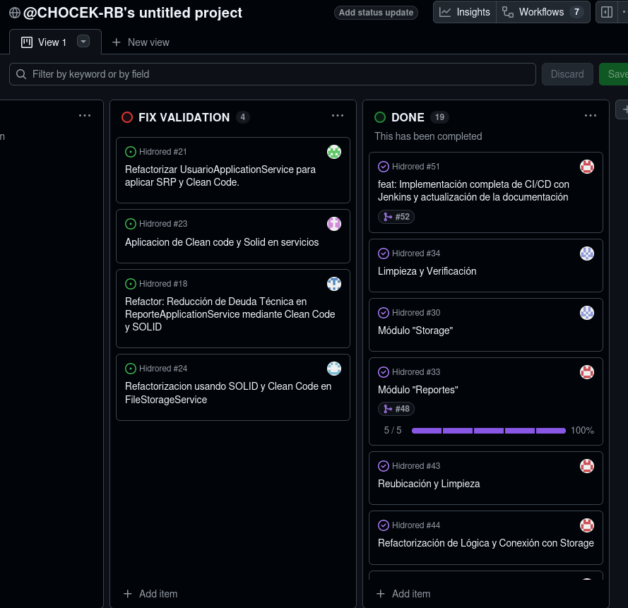

# Hidrored

### Integrantes

- Condorios Chambi, Anthony Richar
- Castelo Choque, Joaquin Andree
- Hanari Cutipa, Cesar Alejandro
- Calcina Muchica, Sergio Eliseo
- Calizaya Quispe, Jose Luis
- Quina Delgado, Marcelo Adrian

---

# **Índice**

- [Tecnologías Utilizadas](#tecnologias)
- [Cómo Empezar](#como-empezar)
  - [Prerrequisitos](#prerrequisitos)
  - [Configuración del Backend (Spring Boot)](#setup-backend)
  - [Configuración del Frontend (React)](#setup-frontend)
- [Propósito](#proposito)
- [Funcionalidades](#funcionalidades)
  - [Diagramas de Caso de Uso](#diagramas-de-caso-de-uso)
  - [Prototipo](#prototipo)
- [Modelo de dominio](#modelo-dominio)
- [Visión General de Arquitectura](#vision-arquitectura)
  - [Capas de Arquitectura](#capas-arquitectura)
  - [Diagrama de Paquetes](#diagrama-paquetes)
- [Módulos y Servicios REST](#servicios-rest)
- [Pipeline de CI/CD con Jenkins](#pipeline-cicd)
  - [Etapas del Pipeline](#etapas-pipeline)
- [Análisis de Calidad de Código](#analisis-calidad)
  - [Estilos de Programación](#estilos-programacion)
  - [Convenciones de Codificación](#convenciones-codificacion)
  - [Principios SOLID](#principios-solid)
  - [Clean Code](#clean-code)
  - [Domain-Driven Design (DDD)](#ddd)
- [Gestión de Proyecto](#gestion-proyecto)

---

<div id="tecnologias"></div>

## **Tecnologías Utilizadas**

| Área                | Tecnología          | Propósito                                                     |
| :------------------ | :------------------ | :------------------------------------------------------------ |
| **Backend**         | Java 11 / 17        | Lenguaje de programación principal.                           |
|                     | Spring Boot         | Framework para la creación de la API REST.                    |
|                     | Spring Data MongoDB | Para la interacción con la base de datos MongoDB.             |
|                     | Spring Security     | Para la gestión de seguridad y autenticación.                 |
|                     | Maven               | Gestor de dependencias y construcción del proyecto.           |
| **Frontend**        | React 18            | Biblioteca para la construcción de la interfaz de usuario.    |
|                     | TypeScript          | Lenguaje de programación para el frontend.                    |
|                     | Vite                | Herramienta de construcción y servidor de desarrollo.         |
|                     | Tailwind CSS        | Framework de CSS para el diseño de la interfaz.               |
|                     | Leaflet             | Biblioteca para la creación de mapas interactivos.            |
|                     | Axios               | Cliente HTTP para la comunicación con el backend.             |
| **Base de Datos**   | MongoDB             | Base de datos NoSQL orientada a documentos.                   |
| **Calidad y CI/CD** | Jenkins             | Servidor de automatización para el pipeline de CI/CD.         |
|                     | Docker              | Para la containerización de la aplicación y sus dependencias. |
|                     | SonarQube           | Para el análisis estático de la calidad del código.           |
|                     | JUnit 5 & Mockito   | Frameworks para pruebas unitarias en Java.                    |
|                     | Postman (Newman)    | Para pruebas funcionales y de API.                            |
|                     | JMeter              | Para pruebas de rendimiento y carga.                          |
|                     | OWASP ZAP           | Para pruebas de seguridad automatizadas.                      |
| **Herramientas**    | Git / GitHub        | Sistema de control de versiones.                              |

---

<div id="como-empezar"></div>

## **Cómo Empezar**

Sigue estas instrucciones para configurar y ejecutar el proyecto en tu entorno local.

<div id="prerrequisitos"></div>

### **Prerrequisitos**

- Java JDK 11 o superior.
- Maven 3.8 o superior.
- Node.js 18 o superior.
- Docker y Docker Compose.

<div id="setup-backend"></div>

### **Configuración del Backend (Spring Boot)**

1.  **Clona el repositorio y navega a la carpeta del backend:**
    ```bash
    git clone <URL_DEL_REPOSITORIO>
    cd Hidrored/
    ```
2.  **Levanta la base de datos con Docker:**
    ```bash
    docker-compose up -d mongo
    ```
3.  **Compila y ejecuta la aplicación:**
    ```bash
    cd backend
    mvn spring-boot:run
    ```
    El backend estará corriendo en `http://localhost:8080`.

<div id="setup-frontend"></div>

### **Configuración del Frontend (React)**

1.  **Navega a la carpeta del frontend:**
    ```bash
    cd ../frontend
    ```
2.  **Instala las dependencias y ejecuta el servidor de desarrollo:**
    ```bash
    npm install
    npm run dev
    ```
    La aplicación frontend estará disponible en `http://localhost:5173`.

---

<div id="proposito"></div>

## Propósito

**Hidrored** busca facilitar la comunicación entre los ciudadanos y las entidades responsables de los servicios de agua y desagüe, permitiendo un reporte ágil y un seguimiento transparente de las incidencias.

- **Centralización de Reportes:** Proporcionar un canal único y accesible para que los usuarios puedan informar sobre problemas de agua y desagüe de manera eficiente.
- **Transparencia y Seguimiento:** Ofrecer a los usuarios la capacidad de rastrear el estado de sus reportes en tiempo real y recibir actualizaciones.
- **Mejora de la Gestión:** Ayudar a las autoridades o empresas de servicios a recibir información detallada y localizada de los problemas, facilitando una respuesta más rápida y efectiva.

---

<div id="funcionalidades"></div>

## Funcionalidades

<div id="diagramas-de-caso-de-uso"></div>

### **Diagramas de Caso de Uso**



<div id="prototipo"></div>

### **Prototipo**



---

<div id="modelo-dominio"></div>

## Modelo de dominio



---

<div id="vision-arquitectura"></div>

## Visión General de Arquitectura

El proyecto sigue los principios de **Domain-Driven Design (DDD)** y **Arquitectura Limpia**, separando las responsabilidades en capas bien definidas. Las dependencias siempre apuntan hacia el interior (hacia el Dominio), lo que protege la lógica de negocio de los cambios en la tecnología externa.

<div id="capas-arquitectura"></div>

### Capas de Arquitectura

#### 1. Capa de Dominio (Corazón del Sistema) 
Es la capa más interna y no tiene dependencias de librerías externas o frameworks.
* **Entidades:** Define los objetos de negocio principales como `Reporte`, `Usuario` y `Comentario`.
* **Interfaces de Repositorio:** Define los contratos para la persistencia (ej. `IReporteRepository`), permitiendo que el dominio no sepa que los datos se guardan en MongoDB.
* **Reglas de Negocio:** Contiene la lógica esencial, como la actualización de estados de un reporte o la creación de IDs únicos.

#### 2. Capa de Aplicación
Orquesta los casos de uso del sistema. Actúa como mediador entre la capa de presentación y el dominio.
* **Servicios de Aplicación:** Clases como `ReporteApplicationService` o `UsuarioApplicationService` que coordinan las tareas necesarias para completar una acción del usuario.
* **Comandos y DTOs:** Utiliza objetos como `CrearReporteCommand` para recibir datos y `UsuarioDTO` para devolver información estructurada a la web.

#### 3. Capa de Presentación (Infraestructura Web)
Es el punto de entrada de las solicitudes externas.
* **Controladores REST:** Clases como `ReporteController` y `UsuarioController` que exponen los endpoints de la API, manejan las peticiones HTTP y devuelven respuestas `ResponseEntity`.
* **Validación de Entrada:** Gestiona los datos recibidos mediante objetos de petición como `LoginRequest`.

#### 4. Capa de Infraestructura Técnica
Implementa los detalles técnicos y herramientas externas.
* **Persistencia:** Implementaciones específicas para MongoDB.
* **Servicios Externos:** El `FileStorageService` que gestiona el guardado físico de imágenes en el servidor local.
* **Configuración:** Clases de seguridad y configuración global en el paquete `shared`.<div id="diagrama-paquetes"></div>

---

<div id="servicios-rest"></div>

## Módulos y Servicios REST

#### 1. Modulo de Reporte 


#### 2. Modulo de Storage 


#### 3. Modulo de Usuario 


#### 4. Modulo Social 



La API REST está organizada en módulos que corresponden a los principales dominios de la aplicación. A continuación se listan los endpoints más relevantes.

> **Nota:** Para una documentación interactiva completa, el siguiente paso sería integrar **SpringDoc (OpenAPI 3)** y **Swagger UI**.

| Módulo          | Método | URL                            | Descripción                                              |
| :-------------- | :----- | :----------------------------- | :------------------------------------------------------- |
| **Usuarios**    | `POST` | `/api/usuarios/registro`       | Registra un nuevo usuario en el sistema.                 |
|                 | `POST` | `/api/usuarios/login`          | Autentica a un usuario y devuelve sus datos.             |
| **Reportes**    | `GET`  | `/api/reportes`                | Obtiene una lista de todos los reportes.                 |
|                 | `POST` | `/api/reportes`                | Crea un nuevo reporte de incidencia.                     |
|                 | `GET`  | `/api/reportes/{id}`           | Obtiene los detalles de un reporte específico por su ID. |
|                 | `GET`  | `/api/reportes/mis-reportes`   | Obtiene los reportes creados por el usuario autenticado. |
|                 | `GET`  | `/api/reportes/cercanos`       | Busca reportes en un radio cercano a una ubicación dada. |
| **Comentarios** | `POST` | `/api/comentarios/{idReporte}` | Agrega un nuevo comentario a un reporte existente.       |
|                 | `GET`  | `/api/comentarios/{idReporte}` | Lista todos los comentarios de un reporte.               |

---

<div id="pipeline-cicd"></div>

## Pipeline de CI/CD con Jenkins

El proyecto está configurado con un pipeline de Integración y Despliegue Continuo (CI/CD) en Jenkins, definido en el archivo `Jenkinsfile`. Este pipeline automatiza todo el proceso de construcción, prueba y despliegue de la aplicación.

<div id="etapas-pipeline"></div>

### Etapas del Pipeline

1.  **Checkout:** Clona el código fuente desde el repositorio de Git.
2.  **Build Frontend:** Instala las dependencias (`npm install`) y construye la aplicación de React (`npm run build`) para producción.
3.  **Build Backend:** Utiliza Maven para compilar el código fuente de la aplicación Spring Boot, gestionar las dependencias y empaquetarla en un archivo `.jar` ejecutable (`mvn clean package -DskipTests`).
4.  **Análisis Estático:** Ejecuta un análisis de calidad de código con SonarQube (`mvn sonar:sonar`) para detectar bugs, vulnerabilidades y "code smells". Los resultados se publican en el servidor de SonarQube.
5.  **Pruebas Unitarias:** Ejecuta la suite de pruebas unitarias con JUnit y Mockito (`mvn test`). Los resultados se archivan para su posterior análisis en Jenkins.
6.  **Pruebas Funcionales:**
    - Inicia la base de datos MongoDB en un contenedor Docker.
    - Inicia la aplicación backend.
    - Ejecuta la colección de pruebas de API de Postman usando **Newman** para verificar la funcionalidad de los endpoints.
    - Genera un reporte de resultados en formato JUnit.
7.  **Pruebas de Rendimiento:**
    - Inicia el entorno completo (base de datos y aplicación).
    - Utiliza **JMeter** para ejecutar un plan de pruebas de carga contra la API.
    - Genera un reporte de rendimiento que es analizado y mostrado gráficamente en Jenkins.
8.  **Pruebas de Seguridad:**
    - Inicia el entorno de la aplicación.
    - Utiliza **OWASP ZAP** en un contenedor Docker para realizar un escaneo de línea base en busca de vulnerabilidades de seguridad comunes.
    - Archiva el reporte HTML generado para su revisión.
9.  **Desplegar Aplicación:**
    - Construye la imagen Docker de la aplicación backend.
    - Utiliza **Docker Compose** para desplegar la aplicación y todos sus servicios (`docker-compose up --build -d`), dejándola en ejecución.

---

<div id="analisis-calidad"></div>

## Análisis de Calidad de Código

<div id="estilos-programacion"></div>

### **Estilos de Programación**

Se aplican estilos de programación orientados a objetos, manejo de excepciones y el patrón "Cookbook" para seguir soluciones probadas, especialmente con el uso de frameworks como Spring.

<div id="convenciones-codificacion"></div>

### **Convenciones de Codificación**

Se siguen las convenciones estándar de Java (PascalCase para clases, camelCase para métodos/variables) para asegurar la legibilidad y consistencia del código.

<div id="principios-solid"></div>

### **Principios SOLID**

El diseño del software se adhiere a los principios SOLID para crear un sistema desacoplado y mantenible:

- **SRP:** Clases con una única responsabilidad (ej. `ReporteController` vs `ReporteApplicationService`).
- **OCP:** Uso de interfaces (`IReporteRepository`) para permitir la extensión sin modificar el código existente.
- **LSP:** Dependencia de abstracciones que permiten sustituir implementaciones.
- **ISP:** Interfaces específicas para cada dominio (`IUsuarioRepository`).
- **DIP:** Inversión de dependencias mediante inyección para desacoplar las capas de alto y bajo nivel.

<div id="clean-code"></div>

### **Clean Code**

Se siguen prácticas de código limpio para mejorar la legibilidad, como nombres significativos, funciones pequeñas, y el principio DRY (Don't Repeat Yourself).

<div id="ddd"></div>

### **Domain-Driven Design (DDD)**

- **Entidades y Objetos de Valor:** Se modelan conceptos como `Reporte` (Entidad) y `ImagenAdjunta` (Objeto de Valor).
- **Agregados:** `Reporte` actúa como raíz de agregado, controlando el ciclo de vida de sus componentes internos como `Comentario`.
- **Repositorios:** Se utilizan interfaces en el dominio para abstraer la persistencia.

---

<div id="gestion-proyecto"></div>

## Gestión de Proyecto

### Github Project
- **URL:** [Git-Hub](https://github.com/users/CHOCEK-RB/projects/1)
- **Tablero:**
  
